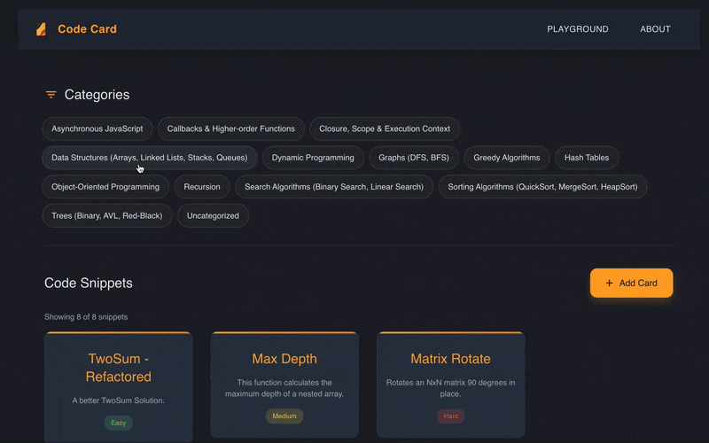
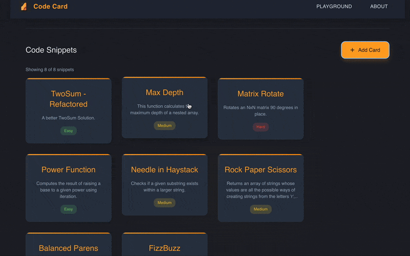
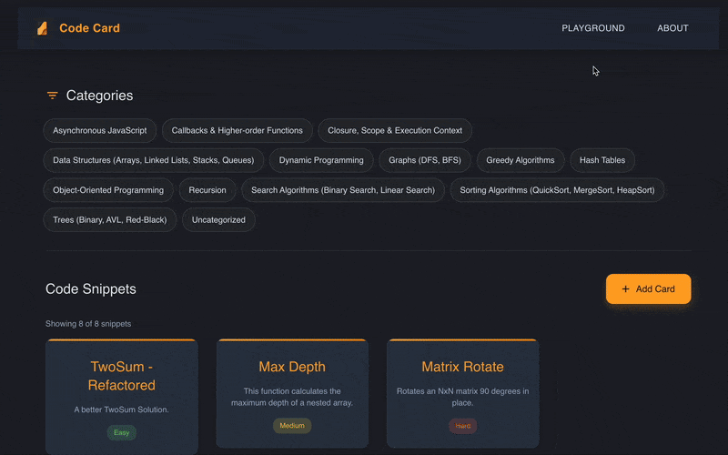

  

## Code Card

Code Card is a platform designed to help developers store, organize, and practice code snippets.
Whether you're learning a new language, preparing for technical interviews, or simply want to keep
your frequently used code patterns in one place, Code Card provides an elegant solution.

---

## Our mission

We believe that efficient coding requires both knowledge and practice. Code Card aims to
provide a centralized repository for your code snippets, making it easier to recall and
reuse solutions to common programming challenges. Our goal is to help you become a more
efficient and knowledgeable developer.

---

## How it works

Simply create cards for your code snippets, categorize them by language and difficulty,
and access them whenever you need. You can view, edit, and practice with your snippets
anytime. The platform is designed to be intuitive and focused on what matters most:
your code.

